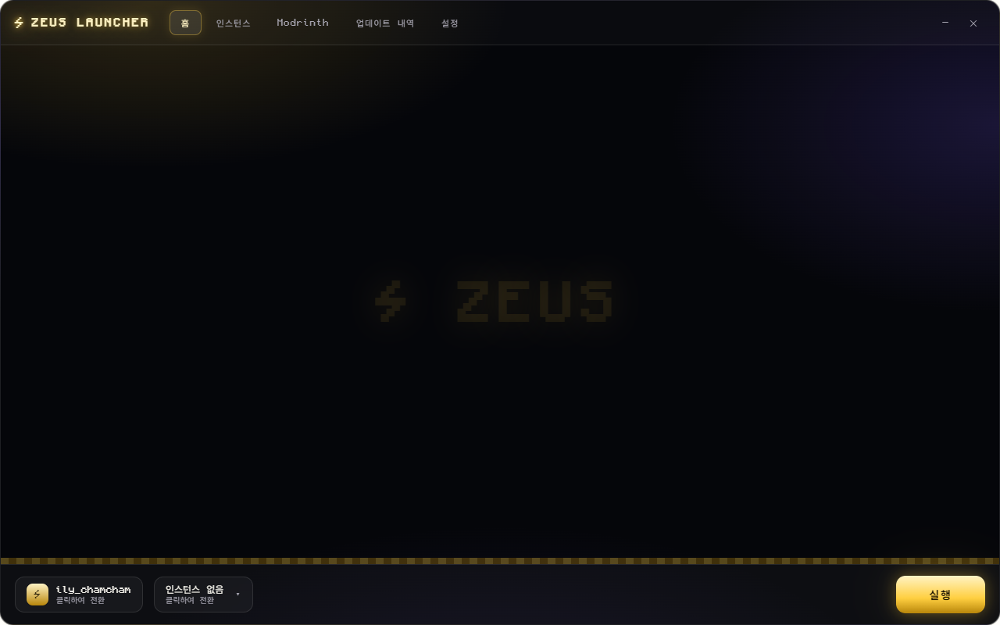
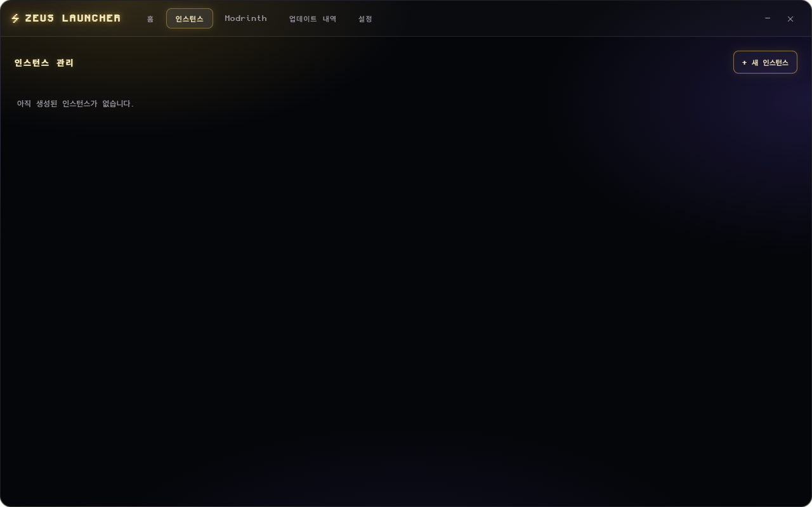
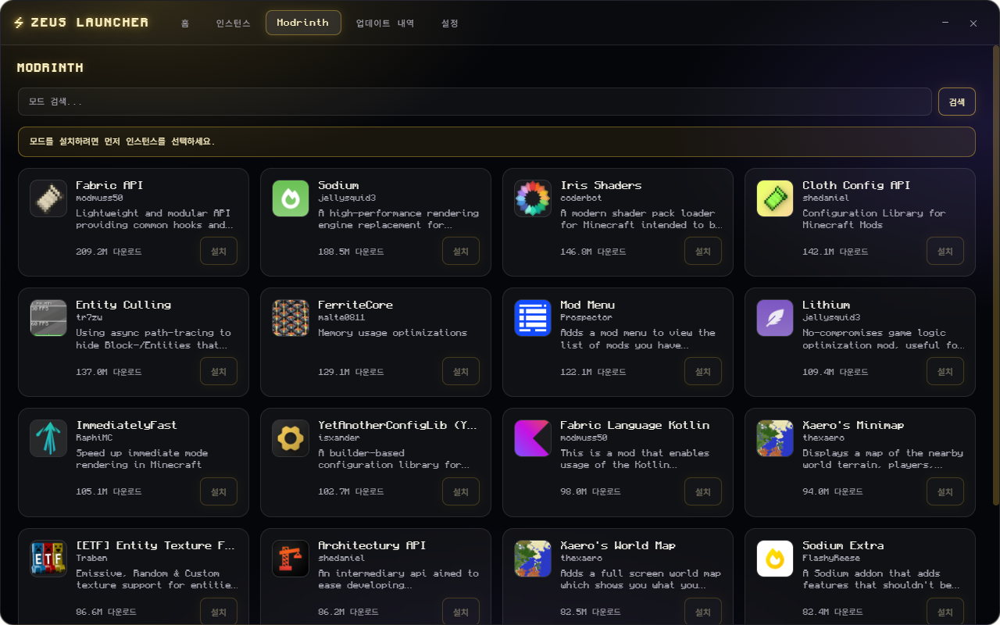
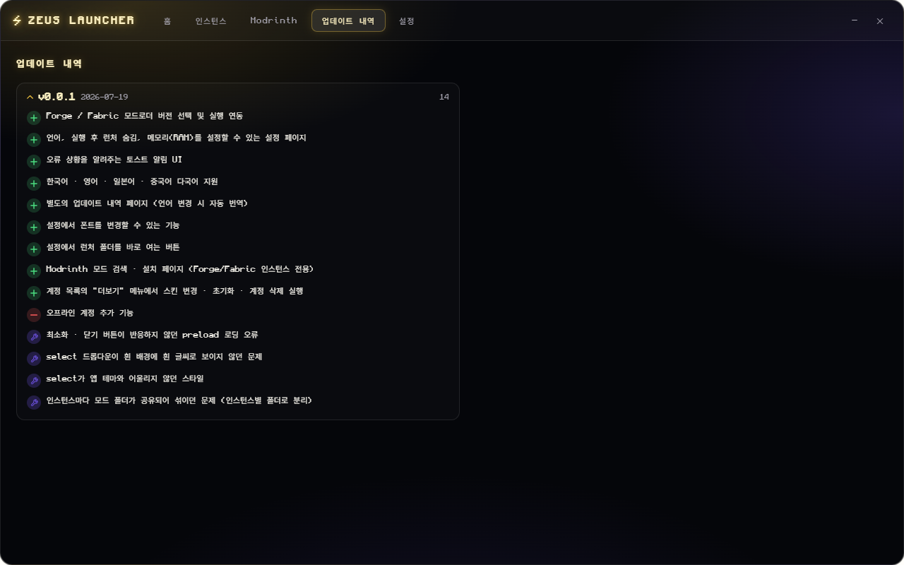
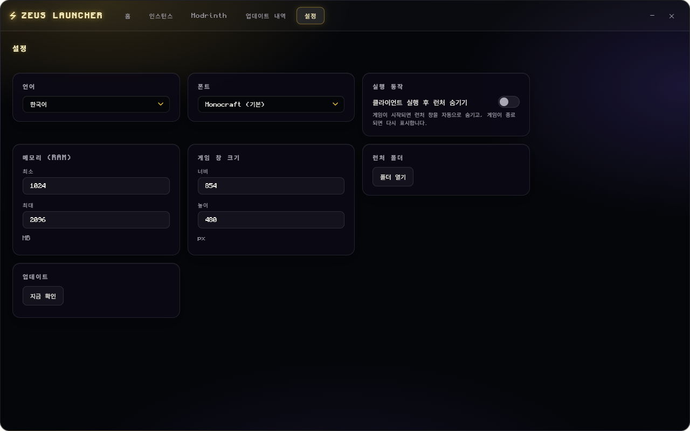

<div align="center">


# ⚡ Zeus Launcher

**使用 Electron 和 Node.js 构建的现代化 Minecraft 启动器**

[](LICENSE)
[](https://www.electronjs.org/)


[한국어](README.md) · [English](README.en.md) · [日本語](README.ja.md) · [中文](README.zh.md)

</div>

---

## 简介

Zeus Launcher 是一款桌面版 Minecraft 启动器，可管理 Vanilla / Forge / Fabric 实例，并直接在应用内通过 Modrinth 搜索与安装模组。支持 Microsoft 账户登录、皮肤管理、多语言界面以及 Discord 状态展示（Rich Presence）。

## ✨ 主要功能

- 🔑 **Microsoft 账户登录** — 管理账户列表，通过图片更改皮肤或重置为默认皮肤
- 🧩 **实例管理** — 创建 Vanilla / Forge / Fabric 实例，并可直接选择模组加载器版本
- 📦 **Modrinth 集成** — 在应用内直接搜索并安装模组（仅限 Forge/Fabric 实例可安装）
- 🌐 **多语言界面** — 韩语 · English · 日本語 · 中文
- 🎨 **自定义 UI 组件** — 使用与主题相匹配的自制下拉菜单和滚动条，替代浏览器原生控件
- 🔔 **Toast 通知** — 以现代化的 Toast 样式展示错误与成功提示
- 🕹️ **Discord Rich Presence** — 实时显示当前所在页面（首页、实例、设置等），游戏运行时显示所选的模组加载器与版本
- ⚙️ **细致的设置项** — 语言、字体、游戏启动后自动隐藏启动器、内存 (RAM)、游戏窗口大小、快速打开启动器文件夹
- 📜 **应用内更新日志** — 可按所选语言查看更新历史

## 📸 截图

| 首页 | 实例 |
| --- | --- |
|  |  |

| Modrinth | 更新日志 |
| --- | --- |
|  |  |

| 设置 |
| --- |
|  |

## 🛠️ 技术栈

| 分类 | 技术 |
| --- | --- |
| 运行时 | [Electron](https://www.electronjs.org/) 32, Node.js |
| 认证 | [msmc](https://github.com/Hanro50/msmc)（Microsoft OAuth） |
| 游戏启动 | [minecraft-launcher-core](https://github.com/Pierce01/MinecraftLauncherCore) |
| 数据存储 | [electron-store](https://github.com/sindresorhus/electron-store) |
| 自动更新 | [electron-updater](https://www.electron.build/auto-update) |
| Discord 集成 | [@xhayper/discord-rpc](https://github.com/xhayper/discord-rpc) |
| 打包 | [electron-builder](https://www.electron.build/) |

## 🚀 快速开始

### 环境要求

- [Node.js](https://nodejs.org/) 18 及以上
- npm

### 安装

```bash
git clone <repository-url>
cd zeus-launcher
npm install
```

### 以开发模式运行

会自动打开 DevTools 的开发模式。

```bash
npm run dev
```

### 正常运行

```bash
npm start
```

### 构建发布版本

```bash
# 当前平台
npm run build

# 指定平台
npm run build:win
npm run build:mac
npm run build:linux
```

构建产物将输出到 `dist/` 文件夹。

## 📁 项目结构

```
src/
├── main/                 # Electron 主进程
│   ├── config/           # 配置存储、路径工具
│   ├── ipc/               # 渲染进程 ↔ 主进程的 IPC 处理
│   └── services/
│       ├── auth/          # Microsoft 认证 / 账户管理
│       ├── discord/       # Discord Rich Presence
│       ├── minecraft/     # 版本查询、实例、启动器、皮肤
│       ├── modloader/     # Forge / Fabric 加载器版本查询
│       ├── modpack/       # 整合包安装
│       ├── modrinth/      # Modrinth 搜索 / 模组安装
│       └── update/        # 自动更新
├── renderer/              # 界面（纯 HTML/CSS/JS）
│   ├── components/        # 自定义下拉菜单、自定义滚动条
│   ├── i18n/               # 多语言资源
│   └── styles/             # 主题样式
└── shared/                # 主进程与渲染进程共用的常量（IPC 通道等）
```

## ⚙️ 配置 Discord Rich Presence

默认使用 `src/main/config/store.js` 中的 `discordClientId` 值。如果你 fork 并重新分发本项目，请在 [Discord 开发者平台](https://discord.com/developers/applications) 创建自己的应用，并替换为你自己的 Application ID。如需完全禁用 Rich Presence，将同一文件中的 `discordRpcEnabled` 设为 `false` 即可。

## 📄 许可证

本项目基于 [MIT 许可证](LICENSE) 开源。
